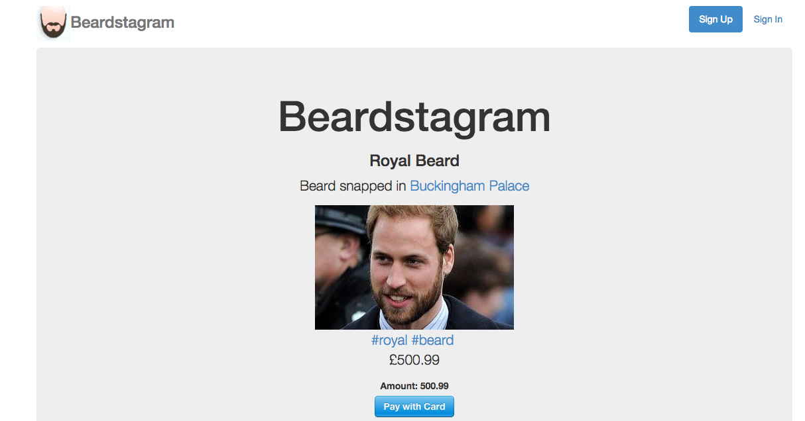

Beardstagram
============

This project was to create a photo sharing website similar to Instagram.

Screenshot:



###Specification

+ Users can post images and tag them
+ Users can add a location which will then be displayed on a map
+ Users can purchase photos on the site

###Technologies used

+ Rails
+ Ruby
+ RSPEC
+ Heroku
+ CSS
+ HTML
+ Bootstrap
+ Devise
+ Google Maps API
+ Stripe
+ Factory Girl
+ Warden
+ Capybara
+ Amazon Web Services

###How to set it up

```sh
git clone https://github.com/aitkenster/beardstagram.git
cd beardstagram
bundle install
```

###How to run it

```sh
cd beardstagram
rails s
```
Open the browser at localhost:3000 to view the app

###How to test it

```sh
cd beardstagram
rspec
``` 
